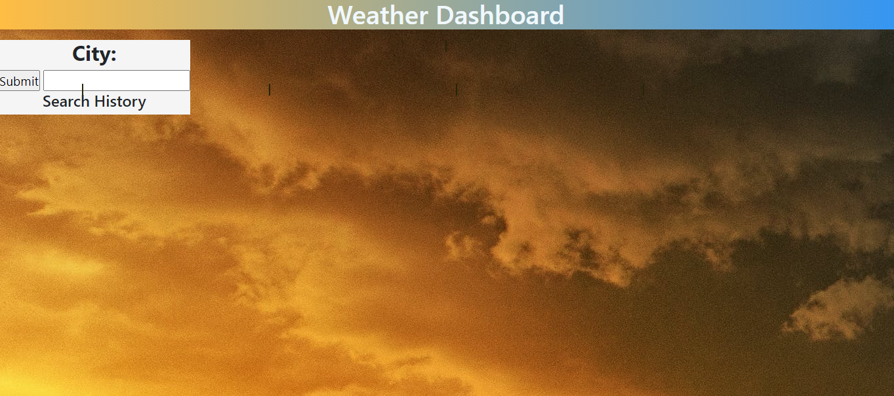

# Homework#5: Weather Dashboard

## Purpose:
When a traveler go out to a new city, they can plan accordingly for the weather in the respective city.
The application will be able to look at multiple cities.

## Criteria:
- When I search for a city, then I am presented with current and future conditions for the city and that city is added to the seach history
- When I view current weather conitions for that city, then I am presented with the city name, the date, an icon representation of weather conitions, the temperature, the humidity, the wind speed, and the UV index
- When I view the UV index, then I am presented with a colour that indicates whether the conditions are favourable, moderate or severe
- When I view future weather conditions for that city, then I am presented with a 5-day forecast that displays the date, an icon representation of weather conditions, the temperature, the wind speed, and the humidity
- When I click on a city in the search history, then I am again presented with current and future conditions for that city

## Link:
https://cathytanya.github.io/weatherDashboard/

## Cover Page:

